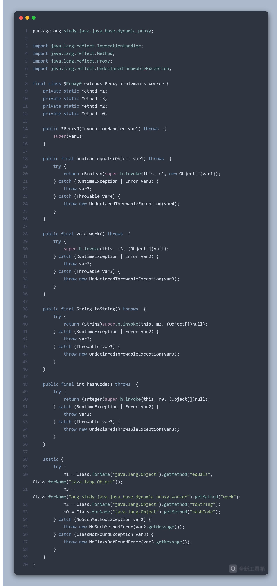

# 动态代理

动态代理是代理模式的一种实现，旨在在内存中动态构建代理对象，实现对目标对象的代理。

静态代理与动态代理的区别主要在： 
* 静态代理在编译时就已经实现，编译完成后代理类是一个实际的 class 文件。 
* 动态代理是在运行时动态生成，编译完成后没有生成 class 文件，而是在运行时动态生成 class 文件，并加载到 JVM 中。

## JDK 动态代理

JDK 动态代理要求目标对象必须实现接口，否则不能使用动态代理。 使用 JDK 动态代理有以下 4 个步骤：

1. 定义一个接口； 
2. 基于这个接口创建一个实现类； 
3. 自定义一个 Handler 实现 `InvocationHandler` 接口，通过重写内部的 `invoke` 方法实现逻辑增强； 
4. 使用 `Proxy` 类的静态方法 `newProxyInstance` 生成一个代理对象并调用方法。

代码实现：

```java
// 目标接口
interface Worker {
      void work();
}
// 目标类
class Programmer implements Worker {
      @Override
      public void work() {
            System.out.println("coding");
      }
}
// 目标对象功能增强
class WorkHandler implements InvocationHandler {
      private Object target;
      public WorkHandler(Object target) {
            this.target = target;
      }
      @Override
      public Object invoke(Object proxy, Method method, Object[] args) throws Throwable {
            System.out.println("before work...");
            Object invoke = method.invoke(target, args);   // 注意这里是 target 而非 proxy
            System.out.println("after work...");
            return invoke;
      }
}
// 测试类
public class JDKProxyTest {
      public static void main(String[] args) {
            Programmer programmer = new Programmer();
            Worker proxy = (Worker) Proxy.newProxyInstance(
                                        programmer.getClass().getClassLoader(),
                                        programmer.getClass().getInterfaces(),
                                        new WorkHandler(programmer));
            proxy.work();
      }
}
```

打印结果：


### 原理
Proxy 的 `newProxyInstance()` 方法大体上将动态代理分为以下 4 个步骤：

1. checkProxyAccess：进行参数验证； 
2. getProxyClass0：生成一个代理类 class 文件或者寻找已生成过的代理类的缓存； 
3. getConstructor：获取生成的代理类的构造方法； 
4. newInstance：生成实例对象，也就是最终的代理对象。

在这 4 个步骤中，第 2 步是关键。其核心是调用了 `ProxyClassFactory` 的 `apply()` 方法生成 class 文件。
在该方法中，首先会生成代理类的文件名（默认文件名是 com.sun.proxy.$Proxy0.class）：


获取到文件名之后，会通过 `ProxyGenerator.generateProxyClass()` 方法生成字节码文件，然后通过 `defineClass0()` 方法生成 Class 对象：


默认情况下生成的字节码文件不保存到本地，如果想要保留有两种方式：

第一种是在启动 VM 参数中加入：`-Dsun.misc.ProxyGenerator.saveGeneratedFiles=true`。

第二种是在代码中加入下面这一句，注意要加在生成动态代理对象之前：
`System.getProperties().put("sun.misc.ProxyGenerator.saveGeneratedFiles", "true");`。

另外需要注意这个文件生成的位置，并不是在 target 目录下，而是在项目目录下的 com\sun\proxy 中。而如果我们定义接口为私有，那么生成的代理类将会在接口所在路径（同样是在项目外）：


将代理类反编译，我们可以看到代理类继承了 Proxy 类并实现了 Worker 接口。



截图上省略了关于 equals、toString、hashCode 方法的实现，实现上和 work 方法一样，都是调用 `super.h.invoke()` 方法。

代理类主要做了下面 3 件事情：
1. 在这个类的静态代码块中，通过反射初始化了多个静态方法 Method 变量，除了接口中的方法还有 equals、toString、hashCode 这三个方法； 
2. 继承父类 Proxy，实例化的过程中会调用父类的构造方法，构造方法中传入的 invocationHandler 对象实际上就是我们自定义的 WorkHandler 的实例； 
3. 实现了自定义的接口 Worker，并重写了 work 方法，方法内调用了 InvocationHandler 的 invoke 方法，也就是实际上调用了 WorkHandler 的 invoke 方法。

至此，我们可以归纳出 JDK 动态代理的执行流程：


### 为什么必须是接口？

我们知道在 java 中想要扩展一个类有两种方式：继承父类和实现接口。查看反编译后的代理类信息可知，代理类需要继承 Proxy 类，而 java 是单继承的。那么代理类就只能通过实现接口来扩展目标类。


在明白这一点之后，我们可以继续往下思考：代理是什么？代理是对目标的逻辑增强，而这段增强的逻辑肯定是用户自定义的。如此一来，代理类的职责就很清晰了：组合目标类和目标类的逻辑增强。

在 JDK 动态代理实现中，逻辑增强就是 InvocationHandler 接口。但 InvocationHandler 的实现类也不仅仅是逻辑增强，它的实现类已经把目标类和对目标类的逻辑增强做到了一起！


那么问题来了：既然 InvocationHandler 已经将目标类和逻辑增强耦合到了一起，代理类又干了什么呢？其实 JDK 动态代理生成的代理类并没有像我们预期的那样绑定目标类和逻辑增强，而是进行了方法转发。


现在我们继续思考：既然在 JDK 动态代理实现中，代理类只负责方法转发，那么代理类还有实现父类的必要吗？如果代理类可以继承父类，那么继承来的那些属性只是白白占用空间，绝对不会使用到。
因此从 JDK 动态代理的实现方式反推，我们就可以知道为什么 JDK 动态代理只能基于接口实现。
