# 故障排查
## jstack
jstack 是 jdk 自带的一款工具，用于生成 jvm 当前时刻的线程快照。其指令为：`jstack [option] pid`，执行后展示信息如下所示：

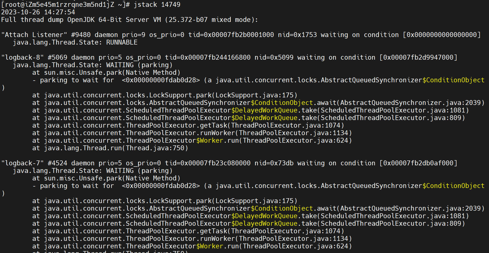

也可以通过该的指令将栈信息保存：`jstack pid > stack[pid].log`。

## jmap
jmap 也是 jdk 自带的一款工具，用于监控 jvm 中的 java 对象。其指令为：`jmap [option] pid`，常用的 option 有以下两个：

### heap
该参数作用是打印堆摘要信息，指令为：`jmap -heap pid`。执行后展示信息如下所示：

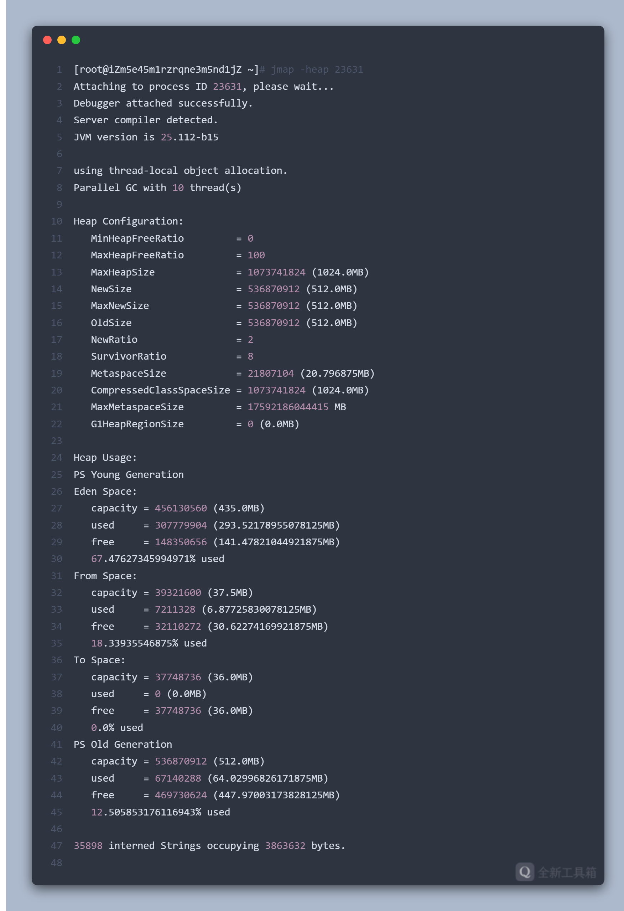

### dump
该参数作用是生成当前 jvm 进程的堆快照（将 jvm 堆信息以 hprof 二进制格式转储到 filename 文件中），指令为：
`jmap -dump:[live,]format=b,file=<filename> pid`（其中 live 是可选参数，如果指定，则只转储堆中的活动对象）。

指令执行结果如下所示：

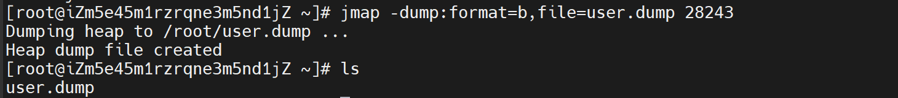

然后我们就可以将生成好 dump 文件下载到本地，然后使用分析工具来分析该文件。最简单的，我们可以使用 jvm 自带 jvisualvm 来打开 dump 文件。

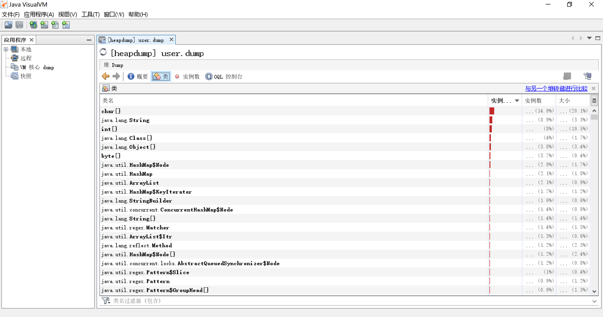

除了这种主动抓取的方式，还有一种被动获取的方式，可以在 java 程序发生 OOM 时为我们生成 dump 文件。在启动 java 程序的指令中增加参数：`-XX:+HeapDumpOnOutOfMemoryError -XX:HeapDumpPath=D:\temp`，需要注意的是，通过该方式生成的 dump 文件是 hprof 类型。

## JProfiler
从 jdk9 开始，Visual VM 不包括在 Oracle JDK 和 Open JDK 发行版中。因此，如果我们使用的是 Java 9 或更高版本，可以从 Visual VM 开源项目站点获得 jvisualvm（https://visualvm.github.io/） 。
当然，我们也可以选择地三方工具，JProfiler 就是一个不错的选择。

JProfiler 可以直接监控 java 程序，也可以分析 dump 文件，但是支持的文件类型是 .hprof。

### 堆溢出排查示例
测试代码：
```java
// -Xms10M -Xmx10M -XX:+HeapDumpOnOutOfMemoryError -XX:HeapDumpPath=D:\temp
public class JProfilerOOMTest { 
    static class OOMObject {} 
    public static void main(String[] args) {
        List list = new ArrayList<>();
        //在堆中无限创建对象
        while (true) {
            list.add(new OOMObject());
        }
    }
}
```

启动增加如下 VM 参数：`-Xms10M -Xmx10M -XX:+HeapDumpOnOutOfMemoryError -XX:HeapDumpPath=D:\temp`。

运行程序即可看到堆溢出错误：

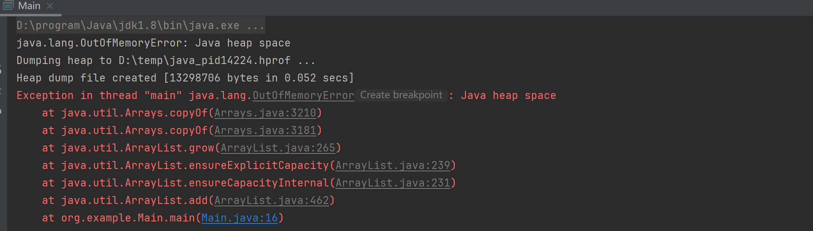

使用 JProfiler 打开 dump 文件：

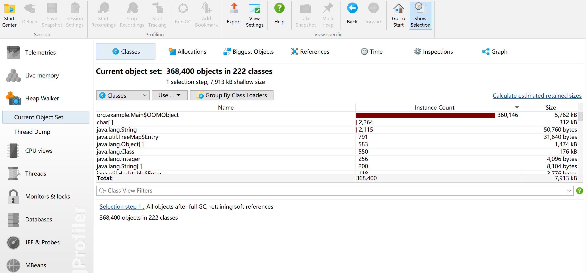

可以看到 OOMObject 对象存在大量实例，查看该对象的持有者（incoming references）, 点击 show more，即可看到出错代码位置：

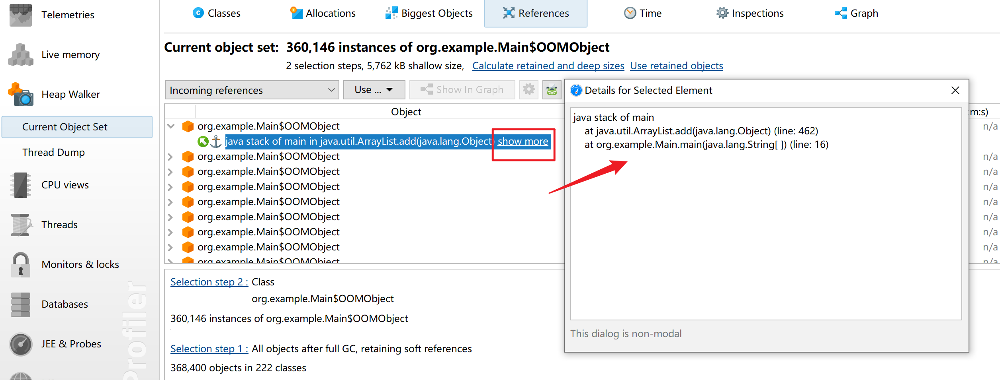

# OOM 场景分析
Java 虚拟机规范中规定除了程序计数器外，虚拟机内存的其他几个运行时区域都有发生 `OutOfMemoryError` 的可能，下面分析会出现此类错误的 9 个场景。

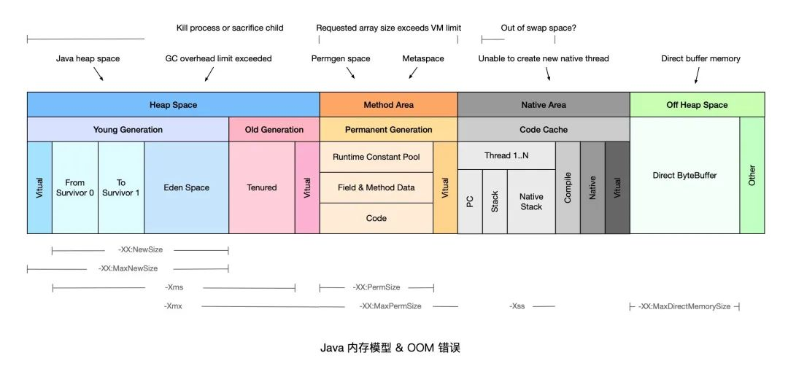

## StackOverflowError
Jvm 虚拟机栈存在栈深，如果不停的入栈而不出栈，就会把栈存满。

测试代码：
```java
public class StackOverflowErrorTest {   
    public static void main(String[] args) {
        javaKeeper();
    }
    private static void javaKeeper() {
        javaKeeper();
    }
}
```

打印结果：

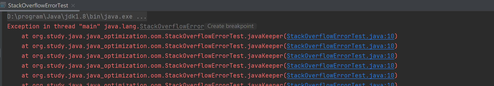

一般来说出现该错误是因为无限递归循环调用。
但有时候也会因为需要递归的层数过深，从而导致还未到达退出条件就已经出现栈溢出错误，针对这种情况我们可以通过 VM 启动参数 `-Xss` 参数增加线程内存空间。

## Java heap space
Jvm 堆空间存在上限，如果对象不断增加，并且 GC Roots 到对象之间有可达路径来避免 GC 清除这些对象，那随着对象数量的增加，总容量触及堆的最大容量限制后就会产生内存溢出异常。 

我们通过 VM 启动参数 `-Xms10M -Xmx10M` 限制 Jvm 堆空间大小。
测试代码：

```java
// -Xms10M -Xmx10M
public class HeapSpaceErrorTest {
    static final int SIZE = 2 * 1024 * 1024;
    public static void main(String[] args) {
        int[] i = new int[SIZE];
    }
}
```

打印结果：

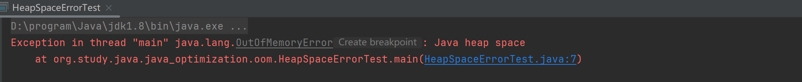

针对大部分情况，我们只需要通过调整 VM 启动参数即可解决问题。如果问题仍没有解决，那么我们需要根据具体问题具体分析。因此我们在 VM 启动参数里增加 `-XX:+HeapDumpOnOutOfMemoryError -XX:HeapDumpPath=D:\temp` 是很有必要的，可以在发生 OOM 帮助我们定位异常原因。
下面是常见的 2 种场景：
1. 创建了超大对象。如数据库一次性全部数据没有做限制；
2. 存在内存泄漏。如没有关闭流（`HttpClient`、IO 流）、`ThreadLocal` 用完没有 `remove`。

## GC overhead limit exceeded

Jvm 抛出该错误的场景是花费 98% 以上的时间执行 GC，但只恢复了不到 2% 的内存，且该动作连续重复了 5 次（俗称：垃圾回收上头）。假如不抛出 `GC overhead limit exceeded` 错误，那 GC 清理得到的一丢丢内存很快就会被再次填满，迫使 GC 再次执行。而 `GC overhead limit exceeded` 的最终导向就是 `Java heap space`。

测试代码：

```java
// -Xms10M -Xmx10M
public class GCOverheadLimitTest {
    static class Key {
        Integer id;
        Key(Integer id) {
            this.id = id;
        }
    }
    public static void main(String[] args) {
        Map m = new HashMap();
        while (true) {
            int i = 0;
            m.put(new Key(++i), i);
            System.out.println("m.size()=" + m.size());
        }
    }
}
```

打印结果：

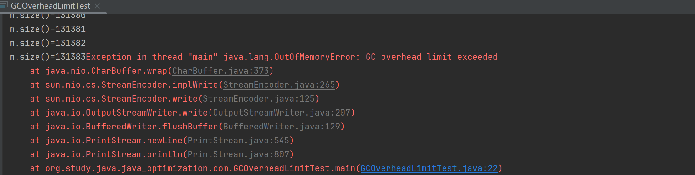

## Direct buffer memory
使用 NIO 经常需要使用 `ByteBuffer` 来读取或写入数据，这是一种基于 `Channel` 和 `Buffer` 的 I/O 方式，它可以使用 Native 函数库直接分配堆外内存，然后通过一个存储在 Jvm 堆里面的 `DirectByteBuffer` 对象作为这块内存的引用进行操作。这样在一些场景就避免了 Jvm 堆和 Native 中来回复制数据，所以性能会有所提高。

但是这样一来就牵扯另一个问题：堆外内存。测试该场景我们需要用到 `ByteBuffer` 类，该类中有以下两个方法：
1. `ByteBuffer.allocate(capability)`：分配 JVM 堆内存，属于 GC 管辖范围，需要内存拷贝所以速度相对较慢； 
2. `ByteBuffer.allocateDirect(capability)`：分配 OS 本地内存，不属于 GC 管辖范围，不需要内存拷贝所以速度相对较快。

最大直接内存（MaxDirectMemorySize）默认是电脑内存的 1/4，我们设置为 5M 模拟异常：`-XX:MaxDirectMemorySize=5m`。

测试代码：
```java
// -Xms10m -Xmx10m -XX:+PrintGCDetails -XX:MaxDirectMemorySize=5m
public class DirectBufferMemoryTest {
    public static void main(String[] args) {
        System.out.println("maxDirectMemory is: "+ sun.misc.VM.maxDirectMemory() / 1024 / 1024 + "MB");
//        ByteBuffer buffer = ByteBuffer.allocate(8*1024*1024);  // Java heap space
        ByteBuffer buffer = ByteBuffer.allocateDirect(6*1024*1024);
    }
}
```

打印结果：

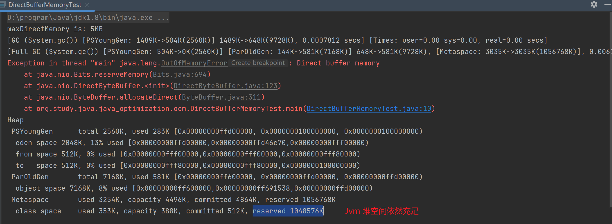

该问题的排查思路如下：
1. 由于 Java 只能通过 `ByteBuffer.allocateDirect` 方法使用 Direct ByteBuffer，因此可以通过 Arthas 等在线诊断工具拦截该方法进行排查； 
2. 检查是否直接或间接使用了 NIO，如 netty，jetty 等； 
3. 通过启动参数 `-XX:MaxDirectMemorySize` 调整 Direct ByteBuffer 的上限； 
4. 检查 VM 参数是否有 `-XX:+DisableExplicitGC` 选项，如果有就去掉（该参数会使 `System.gc()` 失效，`System.gc()` 可以回收堆外内存）； 
5. 检查堆外内存使用代码，确认是否存在内存泄漏；或者通过反射调用 `sun.misc.Cleaner`的`clean()` 方法来主动释放被 Direct ByteBuffer 持有的内存空间 
6. 内存容量确实不足，升级配置。

## Unable to create new native thread

每个 Java 线程都需要占用一定的内存空间，当 JVM 向 OS 请求创建一个新的 native 线程时，如果没有足够的资源分配就会报此类错误。

测试代码：

```java
public class UnableCreateThreadTest {
    public static void main(String[] args) {
        while(true){
            new Thread(() -> {
                try {
                    Thread.sleep(Integer.MAX_VALUE);
                } catch(InterruptedException e) { }
            }).start();
        }
    }
}
```

打印结果：

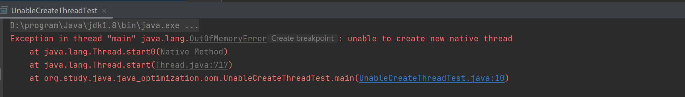

## Metaspace
JDK 1.8 之前会出现 `Permgen space`，该错误表示永久代（Permanent Generation）已满，通常是因为加载的 class 数目太多或体积太大。随着 1.8 中永久代的取消，就不会出现这种异常了。
Metaspace 是方法区在 HotSpot 中的实现，它与永久代最大的区别在于，元空间并不在虚拟机内存中而是使用本地内存，但是本地内存也有打满的时候，所以也会有异常。

测试代码：
```java
//-XX:MetaspaceSize=10m -XX:MaxMetaspaceSize=10m
public class MetaSpaceTest {
    public static void main(String[] args) {
        while (true) {
            Enhancer enhancer = new Enhancer();
            enhancer.setSuperclass(MetaSpaceTest.class);
            enhancer.setUseCache(false);
            enhancer.setCallback((MethodInterceptor) (o, method, objects, methodProxy) -> {
                //动态代理创建对象
                return methodProxy.invokeSuper(o, objects);
            });
            enhancer.create();
        }
    }
}
```

打印结果：

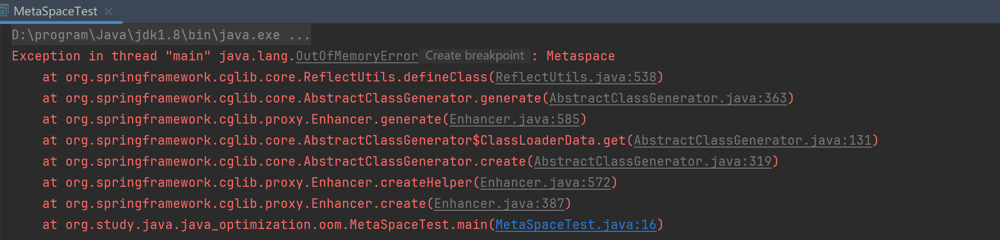

方法区溢出也是一种常见的内存溢出异常，在经常运行时生成大量动态类的应用场景中，就应该特别关注这些类的回收情况。这类场景除了上边的 GCLib 字节码增强和动态语言外，常见的还有，大量 JSP 或动态产生 JSP   文件的应用（远古时代的传统软件行业可能会有）、基于 OSGi 的应用（即使同一个类文件，被不同的加载器加载也会视为不同的类）等。

## Requested array size exceeds VM limit

JVM 限制了数组的最大长度，通常为 `Integer.MAX_VALUE-2`。如果创建的数组超过该限制，就会报错程序请求创建的数组超过最大长度限制。

测试代码：

```java
public class RequestedArraySizeTest {
    public static void main(String[] args) {
        int[] arr = new int[Integer.MAX_VALUE-2];
    }
}
```

打印结果：


## Out of swap space
OS 内存由两部分组成：物理内存（Physical Memory），交换空间（Swap Space），它们统称为虚拟内存（Virtual Memory）。在 JVM 请求的总内存大于可用物理内存的情况下，操作系统会将内容从内存换出到硬盘驱动器。
出现该错误则表示，所有可用的虚拟内存已被耗尽。

## Kill process or sacrifice child
操作系统是建立在流程概念之上的。这些进程由几个内核作业负责，其中一个名为“ Out of memory Killer”，它会在可用内存极低的情况下“杀死”（kill）某些进程。OOM Killer 会对所有进程进行打分，然后将评分较低的进程“杀死”，具体的评分规则可以参考 Surviving the Linux OOM Killer。

不同于其他的 OOM 错误，`Kill process or sacrifice child` 错误不是由 JVM 层面触发的，而是由操作系统层面触发的。

